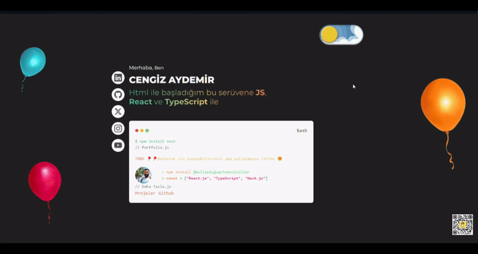

---

# Kişisel Portfolyo

Bu proje, kişisel portfolyo oluşturmak için geliştirilen bir web uygulamasıdır. **Next.js** ile geliştirilmiş olup, modern ve etkileyici bir tasarım sunar. Projede çeşitli animasyonlar, interaktif elementler ve öne çıkan projelerin tanıtımı yer almaktadır.  

## Özellikler

- **Ana Sayfa Tanıtımı:**
  - Kendinizi tanıtan kısa bir yazı.
  - Hareketli balonlar ile dinamik bir görsel deneyim.
- **Portfolyo Alanı:**
  - GitHub üzerinde yayınladığınız projelerin kart tasarımıyla listelenmesi.
  - Her kart üzerinde proje adı, açıklama ve bağlantılar yer alır.
- **Dinamik Tema:**
  - **Next-Theme** ile açık/koyu mod desteği.
- **Animasyonlar:**
  - **Framer Motion** ile sayfa geçişleri ve element animasyonları.
  - **Typewriter Effect** ile dinamik yazılar.
- **Progress Bar:**
  - Sayfa yükleme sırasında üst kısımda ilerleme çubuğu (**Next.js Progressbar**).
- **GraphQL Kullanımı:**
  - Veriler GraphQL üzerinden dinamik olarak alınır.
- **Responsive Tasarım:**
  - **Tailwind CSS** ile her cihaz için kullanıcı dostu bir arayüz.

## Kullanılan Teknolojiler

### Framework ve Araçlar:
- **Next.js**  
- **GraphQL**  

### Kütüphaneler:
- **Tailwind CSS**  
- **Framer Motion**  
- **Typewriter Effect**  
- **Next-Theme**  
- **Next.js Progressbar**  

## Kurulum ve Çalıştırma

1. Proje dizinine gidin:
   ```bash
   cd nextjs-developer-portfolio-project
   ```
2. Gerekli bağımlılıkları yükleyin:
   ```bash
   npm install
   ```
3. `.env.local` dosyasını oluşturun ve GraphQL API URL'inizi ekleyin:
   ```env
   NEXT_PUBLIC_GRAPHCMS_URL=<GraphQL API URL>
   ```
4. Uygulamayı geliştirme modunda başlatın:
   ```bash
   npm run dev
   ```
5. Tarayıcınızda `http://localhost:3000` adresine gidin.

## Ekran Görüntüleri



## Katkıda Bulunma

1. Bu projeyi forklayın.  
2. Yeni bir dal oluşturun:  
   ```bash
   git checkout -b yeni-ozellik
   ```
3. Değişikliklerinizi commit edin:  
   ```bash
   git commit -m "Yeni bir özellik eklendi"
   ```
4. Dalınızı push edin:  
   ```bash
   git push origin yeni-ozellik
   ```
5. Pull Request oluşturun.

## Lisans

Bu proje MIT Lisansı ile lisanslanmıştır. Daha fazla bilgi için `LICENSE` dosyasına bakabilirsiniz.

---
